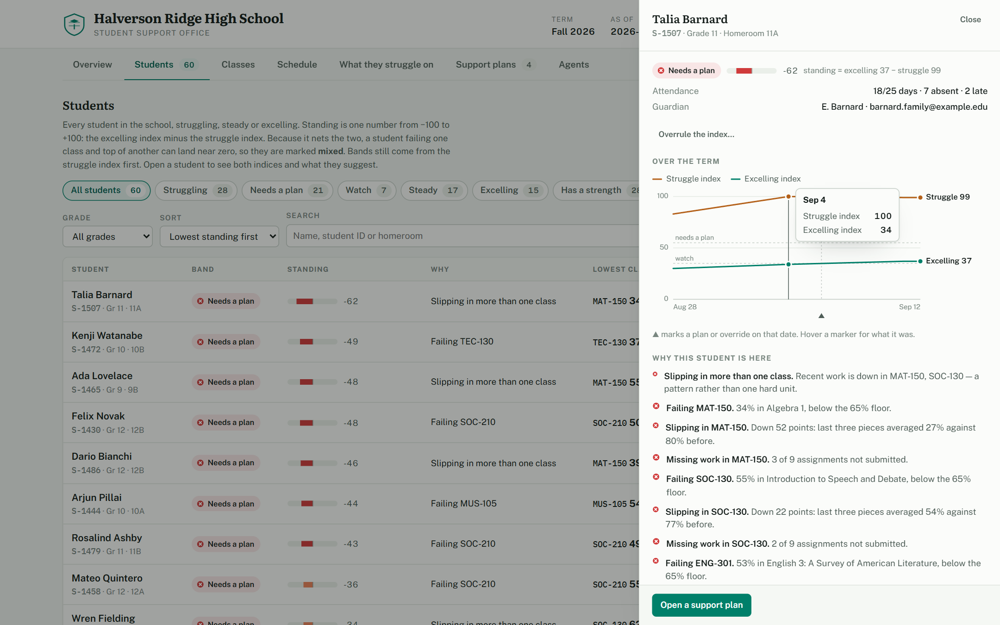
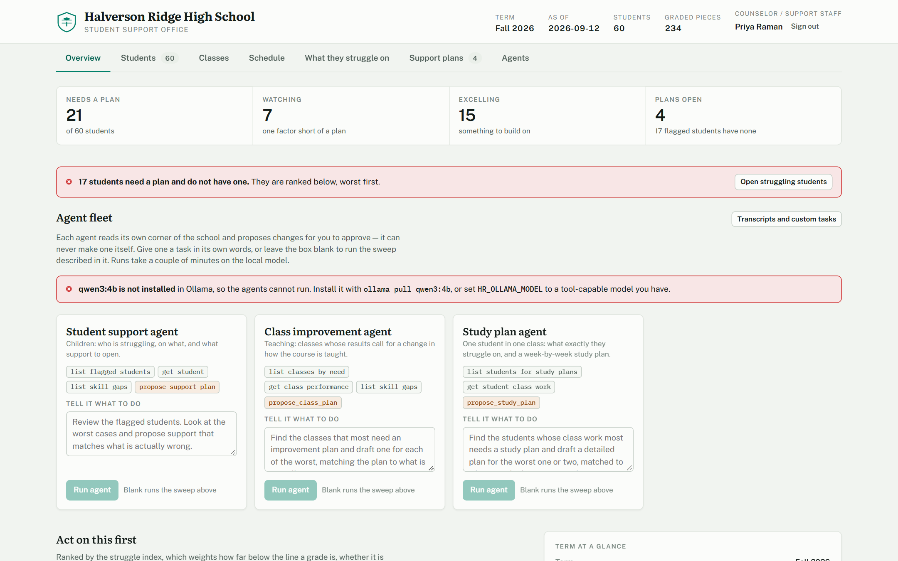
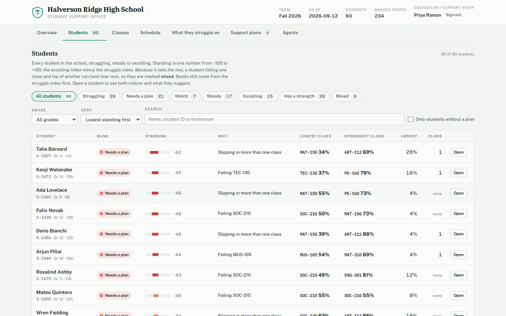
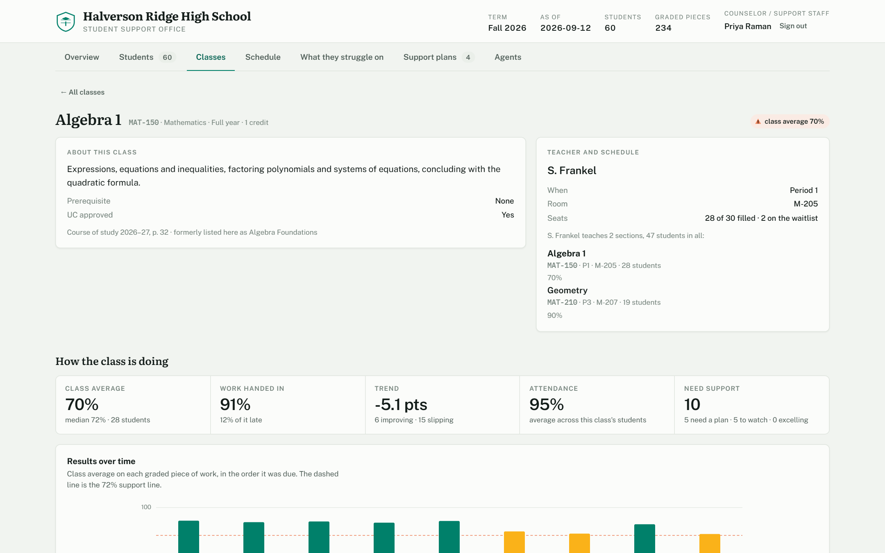
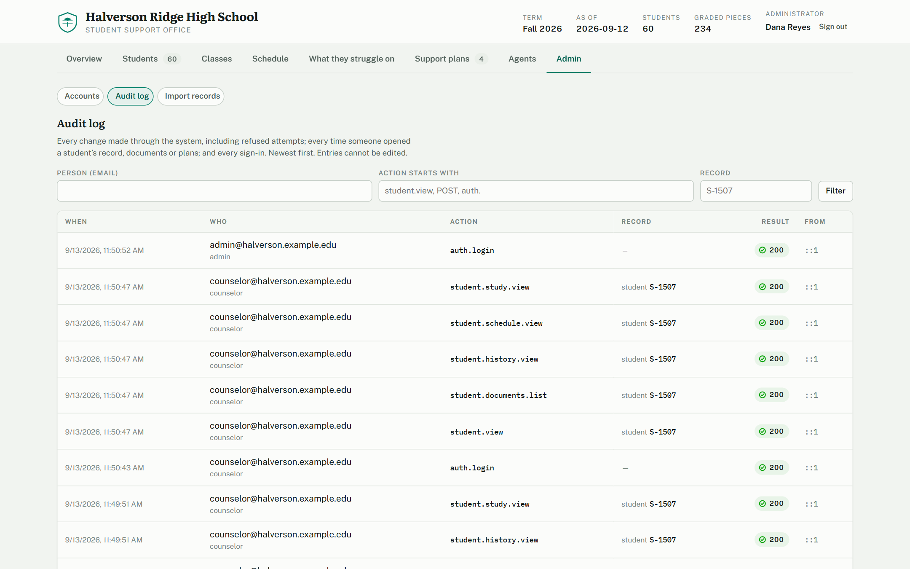
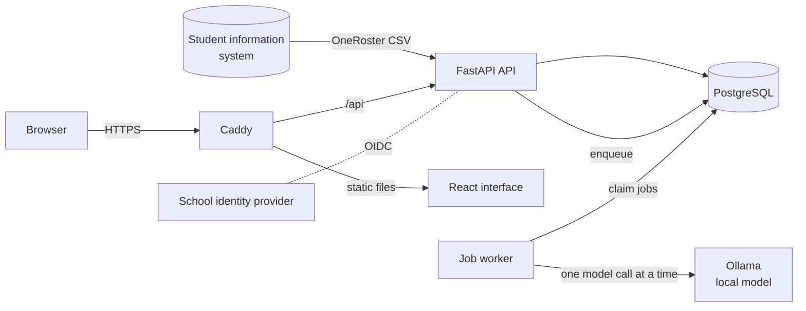

<div align="center">

# Halverson Ridge Student Support

**A student support and intervention platform for a school's support office.**
It shows who is struggling, on what, and what to do about it, and it keeps every
decision accountable.

[](https://github.com/eddierzhang/School-Management-Dev/actions/workflows/ci.yml)




</div>

---

## Why it exists

A grade average says a student is behind. It does not say *on what*, *why*, or
*whether anyone is already helping*. Halverson Ridge answers those three
questions from the gradebook, attendance and the school's own records, then
turns the answer into a plan that a named person owns and that someone can check
later to see whether it worked.

Every number on screen comes with the reasons behind it. AI agents draft plans,
but they can never change a record: a person approves, and deterministic code
applies the change after re-checking it. The model runs on the school's own
hardware, so student records never leave the building.

## Features

**The support workflow**

- **Two indices, not one grade.** A *struggle* index and a separate *excelling*
  index per student, each built from named factors: mastery, trend, missing
  work and attendance. A student failing maths and top of the class in science
  shows as both, not as "average".
- **What they struggle *on*.** Every assessment is tagged with the skill strand
  it tests, so the answer is *word problems, not graphing*. Cohort-wide gaps
  surface as lessons to reteach.
- **Recommendations with an owner.** Rule-based suggestions (homework recovery,
  tutoring on a named strand, a counselor check-in, an attendance plan,
  enrichment), each with its rationale.
- **Plans that can be measured.** Support plans, class improvement plans and
  session-by-session study plans record a baseline when adopted and show
  progress against it.
- **History.** Daily snapshots chart each student's indices over the term, with
  plans marked on the dates they started.
- **People can overrule the index.** A counselor can mark a flag "known and in
  hand" or correct a band, with a reason and an end date. The computed band
  always stays visible beside the override.
- **Documents, read carefully.** Upload a teacher note or report card and a
  local model extracts needs and strengths. Each finding must quote the document
  verbatim, may not diagnose a condition, and is checked against the gradebook.

**Built for a real school**

- **Accounts and roles.** Administrator, counselor, teacher, registrar and
  business office. Teachers see only their own students. School sign-in via
  Google Workspace, Microsoft Entra or any OpenID Connect provider.
- **Audit log.** Every change, including refused attempts, every view of a
  student's record, and every sign-in.
- **Data import.** OneRoster 1.1 CSV from PowerSchool, Infinite Campus, Aeries,
  Skyward or Clever. It is validated before anything is written, is safe to
  re-run, and never deletes a record.
- **Production-ready operations.** Postgres with Alembic migrations, a
  database-backed job queue, Docker Compose deployment behind Caddy with
  automatic HTTPS, nightly verified backups, JSON logs with no student IDs in
  them, and health and readiness endpoints.
- **Optional modules.** Registrar tools (class demand, sections), stockroom,
  budget and a general-manager agent. All are off by default.

<table>
  <tr>
    <td width="50%"></td>
    <td width="50%"></td>
  </tr>
  <tr>
    <td align="center"><sub>Overview</sub></td>
    <td align="center"><sub>Every student, ranked, with reasons</sub></td>
  </tr>
  <tr>
    <td width="50%"></td>
    <td width="50%"></td>
  </tr>
  <tr>
    <td align="center"><sub>A class and how it is doing</sub></td>
    <td align="center"><sub>The audit log</sub></td>
  </tr>
</table>

## How it works



- **The API** computes every index from the gradebook on read, enforces a
  permission on every route, and writes the audit log.
- **The worker** runs the slow work (agent runs, document reads, daily
  snapshots) from a queue in the database, so a restart loses nothing.
- **Agents propose; people approve.** An agent can read its own area of the
  school and record a proposal. Approving one runs deterministic code that
  re-validates it against the current records.

## Quick start

Requirements: Python 3.11, Node 20+, and optionally
[Ollama](https://ollama.com) with a tool-capable model (`ollama pull qwen3:4b`)
for the AI features.

```bash
git clone https://github.com/eddierzhang/School-Management-Dev.git
cd School-Management-Dev

node demo/gen_seed.js                                   # generate the demo school

python3 -m venv backend/.venv
backend/.venv/bin/pip install -r backend/requirements-dev.txt
cp backend/.env.example backend/.env
(cd backend && .venv/bin/python seed.py)                # migrate and seed the demo database

(cd frontend && npm install)
./dev.sh                                                # API, worker and interface
```

Open **http://localhost:5174** and sign in as `counselor@halverson.example.edu`
with the demo password `halverson-demo-2026`. Try `admin@`, `r.okonkwo@` (a
teacher) or `business@` to see how roles change what a person sees. Every demo
account is listed in [docs/development.md](docs/development.md#demo-accounts).

> The demo school, its students and staff are fictional. The demo is built
> around **12 September 2026**; `backend/.env.example` pins the clock to that date.

## Deploying

```bash
cp deploy/.env.example deploy/.env      # domain, secrets, identity provider, model host
docker compose -f docker-compose.prod.yml --env-file deploy/.env up -d --build
docker compose -f docker-compose.prod.yml --env-file deploy/.env exec api \
  python -m app.cli create-user head@school.edu "Head of School" admin --password
```

This starts Postgres, runs migrations, then starts the API, the worker, Caddy
(HTTPS with automatic certificates) and nightly backups. See
[docs/deployment.md](docs/deployment.md) for upgrades, backups and restores,
monitoring, and running the model on a separate GPU machine.

## Documentation

| Guide | What it covers |
|---|---|
| [Support engine](docs/support-engine.md) | The indices, reasons and recommendations; history and overrides; class and study plans; documents; schedules |
| [AI agents](docs/ai-agents.md) | The agent fleet, the propose-and-approve boundary, what was measured about the model and why the code looks the way it does |
| [Security and privacy](docs/security.md) | Roles and permissions, sign-in and OIDC, the audit log, what is logged and what is not |
| [Importing records](docs/data-import.md) | The OneRoster format, the check-then-import flow, re-import rules |
| [Deployment and operations](docs/deployment.md) | The production stack, background jobs, backups, monitoring |
| [Configuration](docs/configuration.md) | Every `HR_*` setting |
| [Optional modules](docs/modules.md) | Registrar and class demand, stockroom, finance, general manager, the registrar console demo |
| [Development](docs/development.md) | Local setup, migrations, tests, CI, project layout |

## Project layout

```
backend/            FastAPI application, Alembic migrations, tests
  app/
    analytics.py    the signal engine: indices, reasons, recommendations
    auth/           accounts, sessions, roles, teacher scoping, OIDC
    ai/             agents, tools, the agent runner, the proposal executor
    routers/        one module per area of the API
    importer.py     OneRoster import
    jobs.py         the job queue; worker.py runs it
frontend/           React + TypeScript interface, and the Caddy config that serves it
deploy/             production settings template, backup and restore scripts
demo/               demo roster generator and the registrar console prototype
docs/               guides and screenshots
```

## Quality

- **288 backend tests.** They run on both SQLite and PostgreSQL 16 and cover
  roles and teacher scoping, OIDC against a fake identity provider, the audit
  log, imports, the job queue, and a check that the models match the migrations.
- **CI on every pull request:** lint, a dependency vulnerability audit, both
  test suites, a frontend typecheck and build, and a full production stack
  brought up in Docker and signed into through Caddy.
- **Dependabot** keeps Python, npm, Docker and GitHub Actions dependencies
  current.

## Limitations

- **The indices are heuristics, not assessments.** They rank attention and do
  not diagnose. A school should calibrate the bands against its own grade
  distribution; every weight and cut-off is in one place in
  `backend/app/analytics.py`.
- **The agents are advisory.** A small local model will sometimes propose
  something unhelpful. Each proposal shows its evidence and full transcript, and
  nothing happens without approval.
- **OneRoster has no skill tag**, so the import needs a `skill` column added to
  `lineItems.csv` for strand analysis.

## Contributing and security

See [CONTRIBUTING.md](CONTRIBUTING.md) for the development workflow and
[SECURITY.md](SECURITY.md) for how to report a vulnerability. Changes are listed
in [CHANGELOG.md](CHANGELOG.md).
